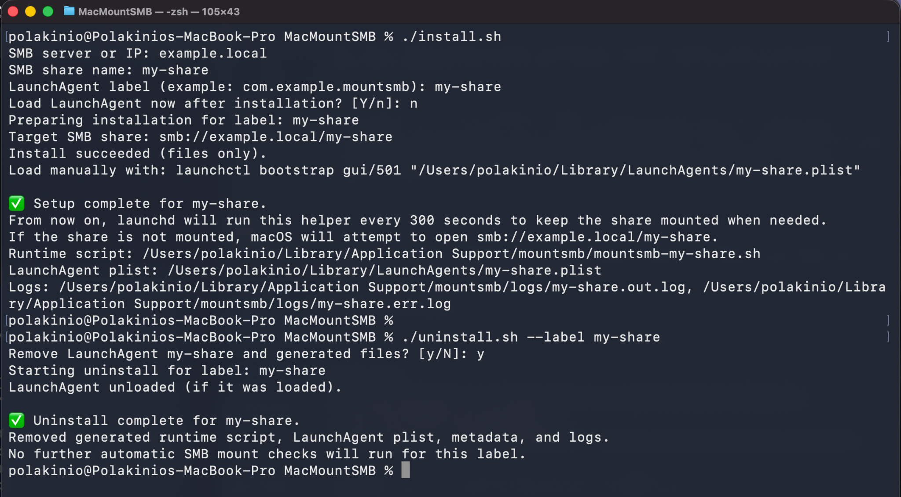

# MacMountSMB

[](#)
[](#)
[](#)
[](LICENSE)

> Automatically reconnect SMB shares on macOS. No friction. Just works.

Keep SMB drives mounted across sleep, Wi-Fi changes, and VPN reconnects.

Designed for developers who are tired of reconnecting SMB shares manually.

No sudo. No system daemons. Fully reversible.

---

## Demo

Full install and clean uninstall flow in seconds:



---

## Why this exists

If you've worked with SMB on macOS, you’ve probably seen this:

- Sleep → mount disappears  
- Wi-Fi changes → disconnected  
- VPN connects → gone again  

Now you're back to manually reconnecting instead of working.

MacMountSMB fixes that.

This is one of those problems that shouldn't exist - but does.

---

## What this does

MacMountSMB runs a lightweight background check in your user session:

- Uses `launchd` through a LaunchAgent  
- Checks whether your SMB share is mounted  
- Reconnects only if needed  
- Uses macOS native SMB handling through `open "smb://..."`  

No hacks. No credential handling. No system changes.

---

## Key Features

- User-scope only, with no sudo and no system daemons  
- Smart reconnect triggered only when the share is missing  
- Native macOS integration through Finder and Keychain  
- Interactive and flag-based installation  
- Clean uninstall with no leftover generated artifacts  
- Logs and debug support  
- Built-in status command for config, run history, and scheduling insights  

---

## Quick Start

```bash
./install.sh
```

If required values are missing, the installer will prompt for them.

---

## Installation

### Interactive

```bash
./install.sh
```

You will be prompted for:

- SMB server or IP  
- SMB share name  
- LaunchAgent label  
- Check interval  
- Whether to auto-load the LaunchAgent  
- Whether to overwrite existing generated files  

---

### Non-interactive

```bash
./install.sh \
  --server SERVER_OR_IP \
  --share SHARE_NAME \
  --label com.example.mountsmb \
  --interval 300 \
  --load \
  --force
```

Using an SMB URL shortcut:

```bash
./install.sh --smb-url "smb://SERVER/SHARE" --label com.example.mountsmb --interval 300 --load
```

### Installer Flags

- `--server <server-or-ip>`  
- `--share <share-name>`  
- `--label <launchd-label>`  
- `--interval <seconds>`  
- `--smb-url <smb://server/share>`  
- `--load`  
- `--force`  
- `--help`  

---

## How it works

- `install.sh` collects values either interactively or through flags  
- It generates a runtime script and a LaunchAgent plist  
- The LaunchAgent runs on load and at the chosen interval  
- The runtime script checks current mounts  
- If the share is missing, it runs `open "smb://..."` to reconnect it  

If you pass `--load`, or choose it during interactive setup, the installer attempts:

```bash
launchctl bootstrap gui/$(id -u) ~/Library/LaunchAgents/<label>.plist
```

If you install without loading it immediately, the installer prints the exact command to run manually.

---

## What gets created

Generated runtime files are installed in user-safe locations:

- Runtime script: `~/Library/Application Support/mountsmb/mountsmb-<label>.sh`  
- LaunchAgent plist: `~/Library/LaunchAgents/<label>.plist`  
- Logs:  
  - `~/Library/Application Support/mountsmb/logs/<label>.out.log`  
  - `~/Library/Application Support/mountsmb/logs/<label>.err.log`  

---

## Status

```bash
./status.sh --label com.example.mountsmb
```

The status command shows:

- Current configured server/share and paths
- Whether the LaunchAgent appears loaded
- Last recorded run result and details
- Total recorded run count
- Estimated next run time based on the configured interval
- Recent stdout/stderr log output

If you omit `--label`, the most recently installed label is used.

## Uninstall

```bash
./uninstall.sh --label com.example.mountsmb
```

Or force:

```bash
./uninstall.sh --label com.example.mountsmb --force
```

✔ Removes LaunchAgent  
✔ Removes scripts  
✔ Removes logs  
✔ Cleans everything  

---

## Requirements

- macOS with `launchd` and `launchctl`  
- SMB share reachable from your machine  
- Access to `~/Library/LaunchAgents`  

---

## Security Notes

- No credential storage in repo  
- Uses macOS Keychain  
- Runs in user space only  
- No sudo required  
- No system changes  

---

## Troubleshooting

```bash
launchctl print gui/$(id -u)/<label>
launchctl kickstart -k gui/$(id -u)/<label>
cat "$HOME/Library/Application Support/mountsmb/logs/<label>.out.log"
cat "$HOME/Library/Application Support/mountsmb/logs/<label>.err.log"
```

---

## Advanced Usage

- Multiple shares (one agent per share)  
- Custom intervals  
- Template-based workflows  
- Manual LaunchAgent control  

---

## Feedback

Found an edge case? Something not working as expected?

Open an issue or drop feedback - this tool is built for real-world usage.

---

## License

MIT. See [LICENSE](LICENSE).
